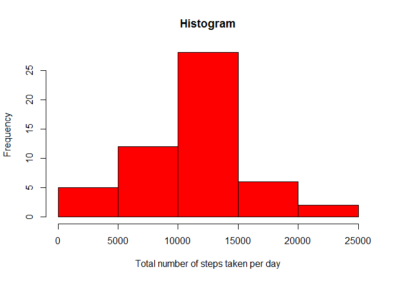
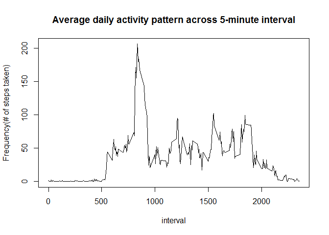
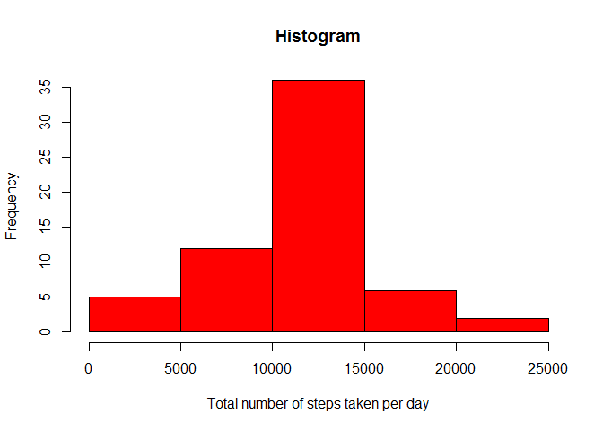
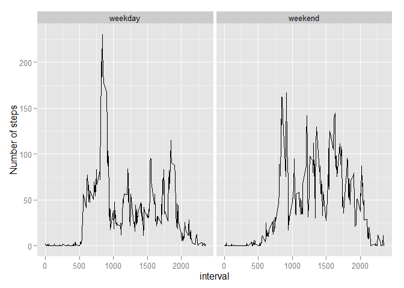

#Title: Reproducible Research: Peer Assessment 1
##Author: Firdhoush K
##Date: Wednesday, April 15, 2015
##Output: PA1_template.html

##1. Read "Activity Monitoring data" from current working directory and store to a data frame. Transform the date column from 'character' to 'date' type. Load required packages for graphics & statistical operations.


```r
 data <- read.csv("repdata_data_activity\\activity.csv",stringsAsFactors = FALSE)
 data$date <- as.Date(data$date,"%Y-%m-%d") ##Coercing to date type.
 require(stats)
 require(ggplot2)
```

```
## Loading required package: ggplot2
```

##2. Total number of steps taken per day. Histogram of the total number of steps taken each day.Report the mean and median of the total number of steps taken per day.


```r
 data <- na.omit(data) ## Removing NA's from the data
 rowsum(data$steps,data$date) ## Total number of steps taken per day
```

```
##             [,1]
## 2012-10-02   126
## 2012-10-03 11352
## 2012-10-04 12116
## 2012-10-05 13294
## 2012-10-06 15420
## 2012-10-07 11015
## 2012-10-09 12811
## 2012-10-10  9900
## 2012-10-11 10304
## 2012-10-12 17382
## 2012-10-13 12426
## 2012-10-14 15098
## 2012-10-15 10139
## 2012-10-16 15084
## 2012-10-17 13452
## 2012-10-18 10056
## 2012-10-19 11829
## 2012-10-20 10395
## 2012-10-21  8821
## 2012-10-22 13460
## 2012-10-23  8918
## 2012-10-24  8355
## 2012-10-25  2492
## 2012-10-26  6778
## 2012-10-27 10119
## 2012-10-28 11458
## 2012-10-29  5018
## 2012-10-30  9819
## 2012-10-31 15414
## 2012-11-02 10600
## 2012-11-03 10571
## 2012-11-05 10439
## 2012-11-06  8334
## 2012-11-07 12883
## 2012-11-08  3219
## 2012-11-11 12608
## 2012-11-12 10765
## 2012-11-13  7336
## 2012-11-15    41
## 2012-11-16  5441
## 2012-11-17 14339
## 2012-11-18 15110
## 2012-11-19  8841
## 2012-11-20  4472
## 2012-11-21 12787
## 2012-11-22 20427
## 2012-11-23 21194
## 2012-11-24 14478
## 2012-11-25 11834
## 2012-11-26 11162
## 2012-11-27 13646
## 2012-11-28 10183
## 2012-11-29  7047
```

```r
 ## Histogram of the total number of steps taken each day
 hist(rowsum(data$steps,data$date),col="red",xlab="Total number of steps taken per day",main="Histogram")
```

 

```r
 s<- summary(rowsum(data$steps,data$date)) ## Computing mean and median of the total number of steps taken per day.
```
###The Median :10765   and Mean   :10766   for total number of steps taken per day.  The 1st Qu.: 8841   and 3rd Qu.:13294   for total number of steps taken per day.

##3. Average daily activity pattern across 5-minute interval.

```r
  x<-aggregate(data[,1],list(interval=data$interval),mean) ## Computing Average daily activity pattern across  
                                                           ##  5-minute interval
  ## Plot of the total number of steps taken each day across 5-minute inerval.
  plot(x,type="l",ylab="Frequency(# of steps taken)",main="Average daily activity pattern across 5-minute interval")
```

 

### 5-minute interval number 835,contains the maximum number of steps on average across all the days in the dataset.

##4. Inputting missing values.

```r
 data <- read.csv("repdata_data_activity\\activity.csv",stringsAsFactors = FALSE)
 data$date <- as.Date(data$date,"%Y-%m-%d")
 m<-sum(is.na(data[,1])) ##Finding number of missing values.
 
 ## Filling missing data with mean from the same interval, where means are stored in variable x(Taken from Section 3)
 for (i in  1:17568) {
       if (is.na(data[i,1]) == "TRUE" ) {
        for (j in  1:288){
          if (data[i,3] == x[j,1] ){
          y<- x[j,2]
          }
        } 
        data[i,1] <- y
    }
   }

 
 s<-summary(rowsum(data$steps,data$date)) ## Computing mean and median of the total number of steps taken per day.
 ## Histogram of the total number of steps taken each day after filling NA's with mean.
 hist(rowsum(data$steps,data$date),col="red",xlab="Total number of steps taken per day",main="Histogram") 
```

 

###The total number of missing values in this dataset is 2304

###The Median :10766   and Mean   :10766   for total number of steps taken per day. This values doesn't change even after filling the NA's. The 1st Qu.: 9819   and 3rd Qu.:12811   for total number of steps taken per day.The quartiles have changed as the input values had an impact on those range of data as NA's are more occuring there.

##5. Patterns between weekdays and weekends.Creation of new factor column "wd" indicating weekend or weekday.


```r
  ## Creating new factor column "wd" indicating weekend or weekday.
  data$wd <- "weekday" 
  data$wd[weekdays(data$date) == "Saturday" | weekdays(data$date) == "Sunday" ] <- "weekend"
  z<-aggregate(data[,1],list(interval=data$interval,week=data$wd),mean)## Computing Average daily activity pattern 
                                                                       ## cross  5-minute interval 
          
  ggplot(z,aes(interval,x)) + geom_line() + facet_grid(.~week) + ylab("Number of steps")
```

 
